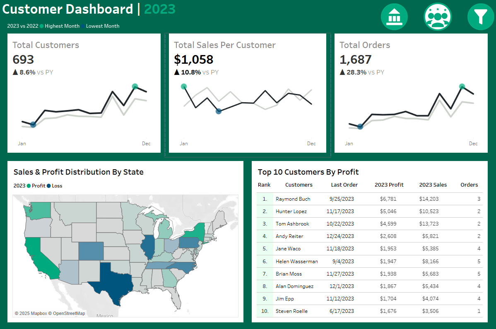

# Sales & Customer Performance Analysis Dashboard | Tableau

## Project Overview
This project involves building a **dual-dashboard Tableau** visualization for analyzing and visualizing sales and customer data, providing actionable insights into **sales growth**, **profit margins**, and **regional performance**. The dashboards utilize **KPIs**, **geographic maps**, and **time-series visualizations** to empower data-driven decision-making.

## View the Tableau Dashboard Online
You can access the interactive dashboard online by clicking on the link below:
- [Sales & Customer Performance Analysis Dashboard - Tableau Public](https://public.tableau.com/views/SalesCustomerPerformanceAnalysisDashboard/SalesDashboard?:language=en-US&:sid=&:redirect=auth&:display_count=n&:origin=viz_share_link)

## Screenshots
Here are some screenshots of the dashboards:

  
*Sales Dashboard: Overview of sales performance, showing KPIs like sales growth and regional sales distribution.*

  
*Customer Dashboard: Detailed view of customer segments and their performance across different states.*

  
*Dynamic Filter: Allows users to interact with the dashboard by selecting customer segments and regions for deeper analysis. This enables a more personalized and focused investigation of the data.*

  
*Tooltip Example: The tooltip labels specific areas of interest on the dashboard, providing additional context and insights, such as regional trends or product-specific performance.*

## Key Features
- **Dual-Dashboard Design**: The project features two interactive dashboards:
  - **Sales Dashboard**: Displays key metrics related to sales performance.
  - **Customer Dashboard**: Provides insights into customer segments and state-by-state performance.
- **Interactive KPIs**: The dashboards track **20.4% Year-over-Year (YoY) sales growth** and **14.2% profit growth**, allowing users to monitor performance at a glance.
- **Geographic Maps**: Visualizes sales and profit distribution across different regions, helping to identify top-performing states and areas with potential for growth.
- **Dynamic Filters**: Offers users the ability to filter data by customer segments and state-level performance, enabling granular analysis.

## Key Insights & Analysis
- **Overall Sales & Profit Growth**: The dashboard reveals a **20.4% sales growth** and **14.2% profit growth** YoY, highlighting a positive trend in sales performance and overall profitability.
- **Regional Sales Distribution**: Geographic maps provide a visual representation of how sales and profits are distributed across regions, helping businesses identify regions for expansion or focus.
- **Customer Segments**: Analysis of customer segments highlights the categories driving growth, while also revealing opportunities for improvement in underperforming segments.
- **Time-Series Insights**: Time-series visualizations track the evolution of sales and profits, offering insights into trends, seasonality, and potential areas for boosting sales during peak periods.

## Tools Used
- **Tableau**: Used for data visualization and creating the interactive dashboards. Tableau's capabilities allowed for the seamless integration of KPIs and geographic maps.
- **SQL**: Used for data extraction and aggregation, enabling efficient queries to process the large dataset required for meaningful insights.

## Installation & Usage
1. Download the necessary project files here:
   - [Download ZIP file](https://github.com/marlopenaga/Sales-Customer-Performance-Analysis-Dashboard/blob/main/Tableau%20Sales%20%26%20Customer%20Dashboard%20Project.zip)
2. Extract the contents of the ZIP file and open the `.twb` or `.twbx` Tableau workbook to explore the interactive dashboards.
3. Use the dynamic filters in the dashboard to analyze customer segments and regional performance.
4. Optionally, you can explore the dataset and other supporting files included in the ZIP file.

## Future Enhancements
- Continue learning and discovering more creative and insightful ways to visualize data.
- Integrate additional data sources to enhance the analysis of customer behavior and ratings. Expanding the dataset to include information from other departments could provide valuable insights for improving performance and maintaining growth.

## License
This project is licensed under the MIT License - see the [LICENSE](LICENSE) file for details.
